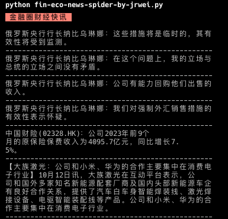

some-spider-code
----------------

### usage

```bash
# runtime: python >= 3.8
python -m venv venv
source venv/bin/activate
pip install -r requirements.txt
# then run code
python fin-eco-news-spider-by-sina.py
# ...
```

### fin-eco-news-spider-by-sina

>   [fin-eco-news-spider-by-sina.py](./fin-eco-news-spider-by-sina.py)：新浪全球实时财经新闻爬虫。


### fin-eco-news-spider-by-eastmoney

>   [fin-eco-news-spider-by-eastmoney.py](./fin-eco-news-spider-by-eastmoney.py)：东方财富全球财经快讯爬虫。


### fin-eco-news-spider-by-jrwei

>   [fin-eco-news-spider-by-jrwei.py](./fin-eco-news-spider-by-jrwei.py)：金融圈财经快讯爬虫。



### fund-value

>   [fund-value.py](./fund-value.py)：基金净值爬虫。

```bash
# 8888 as port
python fund-value.py 8888
```

Open `http://127.0.0.1:8888/012414` in browser. You can change `012414` (fund code) to another. See all codes in [data/fund.csv](./data/fund.csv) file.

Response example:

```json
{
    "code": 200,
    "message": "ok",
    "data": {
        "fund_code": "002939",
        "fund_name": "广发创新升级混合",
        "net_value": "1.9049",
        "net_value_date": "2023-11-15",
        "estimated_net_value": "1.8643",
        "estimated_growth_value": "-0.0406",
        "estimated_growth_rate": "-2.13%",
        "estimated_at": "2023-11-16 15:00:00"
    }
}
```

### stock-price

>   [stock-price.py](./fund-value.py)：股票行情爬虫。

symbol rule:

```
sh600519
sz300750
```
